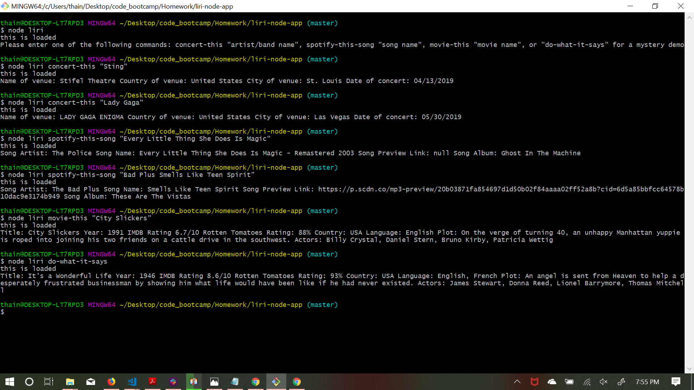

# LIRI Node App

# Description

LIRI is like iPhone's SIRI. However, while SIRI is a Speech Interpretation and Recognition Interface, LIRI is a _Language_ Interpretation and Recognition Interface. LIRI is a command line node app that takes in parameters and gives you back data.

# Screenshot

Here is a screenshot demonstrating LIRI:



# Tech Used

* JavaScript
* Node.js
* Moment.js
* Axios
* Spotify API
* Bands In Town API
* OMDB API

# Code Example

#### This switch statement takes in terminal input commands using process.argv. Each command is attached to the relative API.

```
...
var liriInput = process.argv[2];
var liriInput1 = process.argv[3];
...

function switchCase() {

    switch (liriInput) {

        case "concert-this":
            concertThis(liriInput1);
            break;

        case "spotify-this-song":
            spotifyThis(liriInput1);
            break;

        case "movie-this":
            movieThis(liriInput1);
            break;

        case "do-what-it-says":
            doThis();
            break;

        default:
            console.log('Please enter one of the following commands: concert-this "artist/band name", spotify-this-song "song name", movie-this "movie name", or "do-what-it-says" for a mystery demo');
            break;
    }
}
```

# API Reference

* Spotify: https://developer.spotify.com/documentation/web-api/reference/
* OMDB: http://www.omdbapi.com/
* Bands In Town: https://www.artists.bandsintown.com/support/api-installation

# Operating Instructions

To operate LIRI, simply type "node liri" into the terminal. It will then display operating instructions on the screen. 

# Additional Features

The movie-this and spotify-this commands have default parameters. Simply type either of those commands with no specifying parameter to load it's default. 

The spotify-this command also allows the user to specify the artist/band name with the name of the song you want to look up. Simply type the name of the artist or band before the name of the song. 
