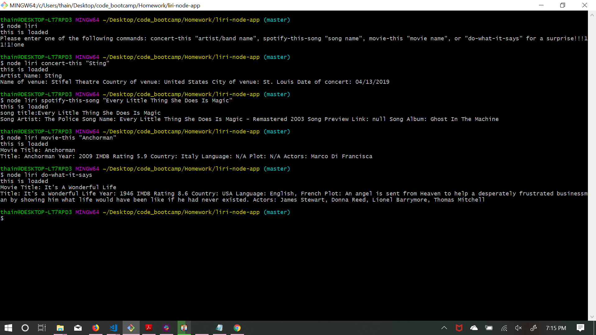

# liri-node-app

### Description

LIRI is like iPhone's SIRI. However, while SIRI is a Speech Interpretation and Recognition Interface, LIRI is a _Language_ Interpretation and Recognition Interface. LIRI is a command line node app that takes in parameters and gives you back data.

### Operating Instructions

To operate LIRI, simply type <node liri> into the terminal to display the instructions of how to use the app. 

Here is a screenshot demonstrating LIRI:

